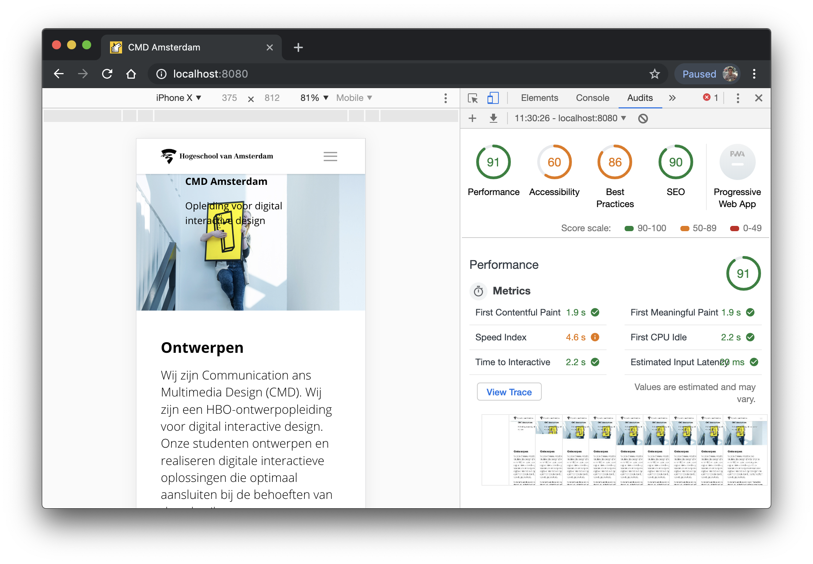
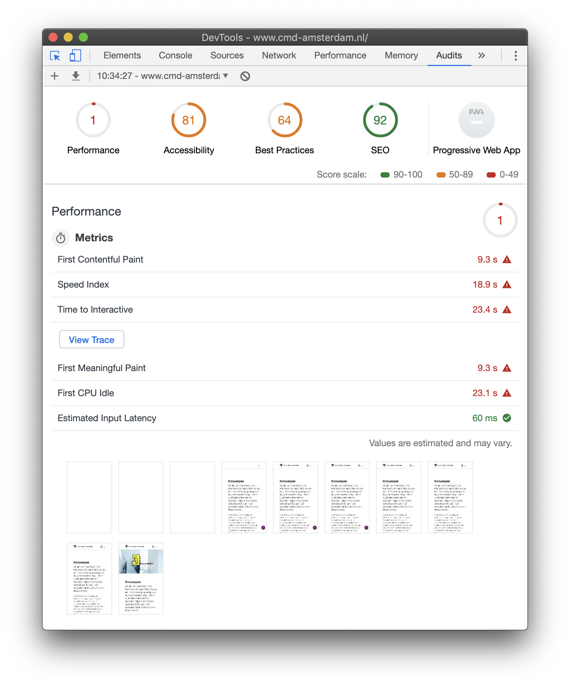
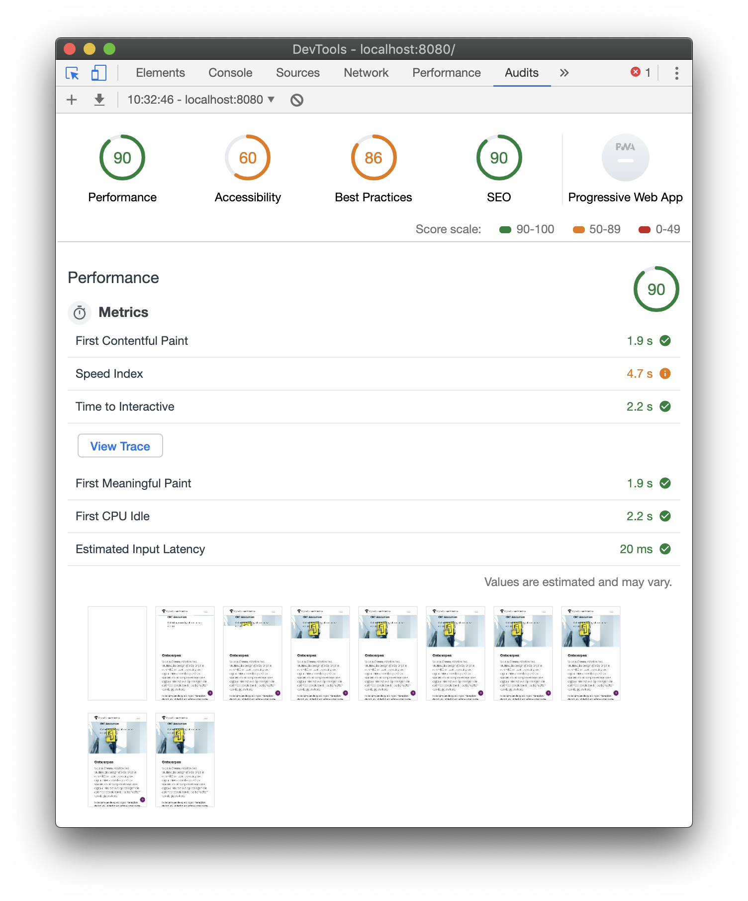

<div align="center">
	<h1 align='center'>CMD Amsterdam</h1>
	
</div>
<p align="center">
	Redesign website of CMD Amsterdam for a better performance and accessibility.
	<br>
	<!-- <a href="#">Live demo</a> -->
</p>
<br>

## Table of contents

- [Install](#install)
- [Research](#research)
- [Status](#status)
- [To do](#to-do)
- [Sources](#sources)

## Install

You have to need [Node.js](https://nodejs.org/en/download/) installed on your computer to run this project. To install this project on your computer, please follow the steps below from your command line:

```shell
# Clone repository
git clone https://github.com/peppequint/project-2-1819.git

# Go to the repository
cd browser-technologies-1819

# Install dependencies
npm install

# Server + file changes are detected
npm run dev
```

## Research

There are many improvements possible on the website of CMD Amsterdam. To see what the possibilities are, I ran an audit to see what is happening.

To my surprise, the grading of the website was an one out of hundred. Mostly, the images are to big and there is a lot of unused CSS and HTML elements.

So, what are the most important things that needs to be improved:

- Images needs to be compressed
- HTML structure needs to be redone
- CSS structure needs to be checked for unnecessary code
- Files needs to be minified to improve the loading speed
- Store most of the file in cache



## Status

For so far I made a view changes to the website. All files are stored in cache. So, when an user is reloading on a slow 3G network, the first content loaded into DOM takes 2 seconds.

Second, the page is server-side rendered. The pros of a server-side rendered website is that it is better for SEO. In addition, the first page of the website loads faster. It is great for static websites.

As the screenshot shows below, the performance of the website has really improved.



## To do

However, due to lack of time I've not been able to do all the things I want to do. There are a lot of things that needs to be done to get the 100% score.

- Service worker needs to be finished. There are some issues that I need to figure out what is happening.
- Transport the image folder to the dist-folder to get a minified website. This helps the loading speed of the website.
- Not all the content is used in this demo.
- There is no interaction in this demo, so I didn't write good fallbacks when, for example, an user has an outdated mobile.
- For blind people, the website is 'usable'. But for people who has issues with colours, the website is not optimised.
- The website is not optimised for desktop. I started to build this demo for mobile, but didn't finish to make it for desktop.

## Sources

- [Service worker](https://serviceworke.rs/strategy-cache-and-update_service-worker_doc.html)
